[[_TOC_]]

# HWM085-34387

Four Corner Welding Machine.

First project, Uniqwork

Single Heritage

# Running Mode

## Manual Page
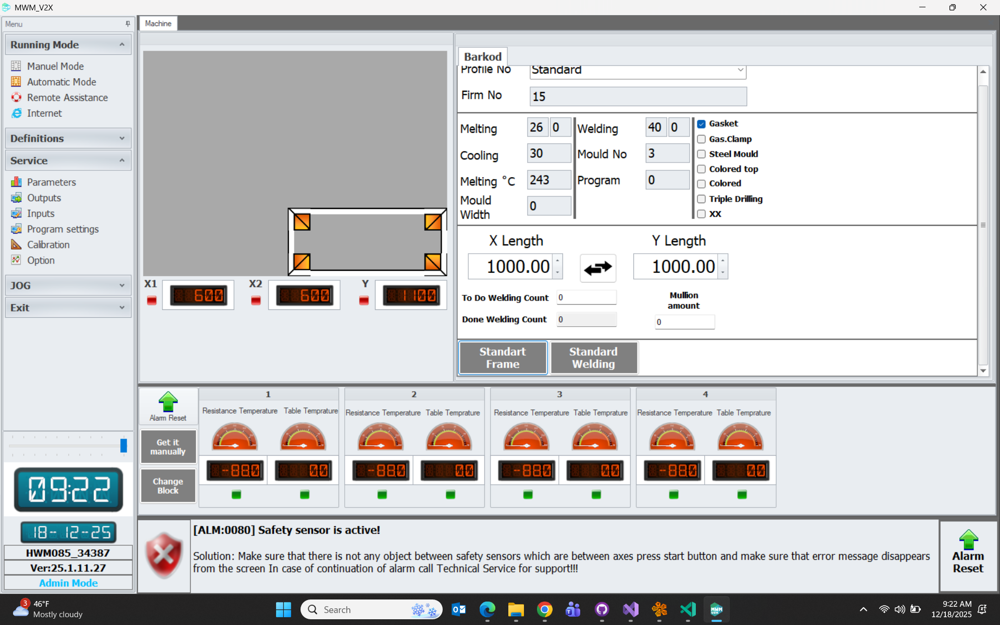

**Manual Page:** This is the work page where manual welding operations are performed.
- **Standard Frame:** Used for 4-corner welding operations.
- **U Frame:** Used for U-shaped threshold frame operations.
- **Standard Welding:** Used for 45-45 cut standard welding mode.
- **Heritage Welding:** Used for 45-90 cut and notched welding mode. **Performed on one side only**
- **Timberweld Welding:** Used for 45-90 cut and notched welding mode. **Performed on both sides**
- **Manual Pick-up:** If activated, frame unloading operation is not performed. The frame is picked up by the operator from inside the machine.
- **Change Mold:** If activated, it positions the axes to the mold changing position for mold replacement.

## Automatic Page
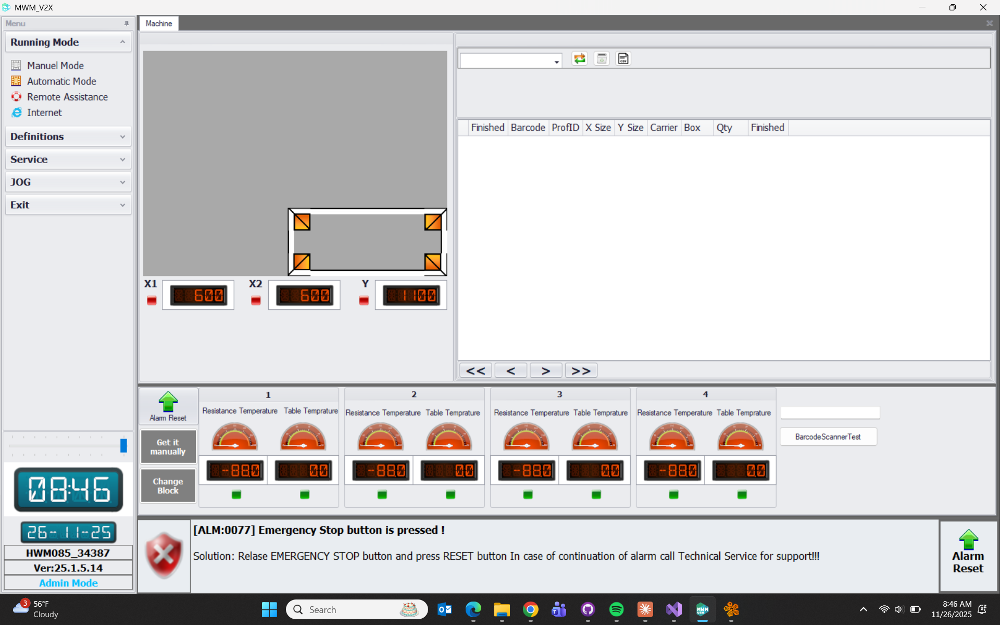

**Automatic Mode:** This is the work page where the data required for the welding operation is taken from the job file.
The relevant page for the job file is opened by clicking the button labeled **Csv**.
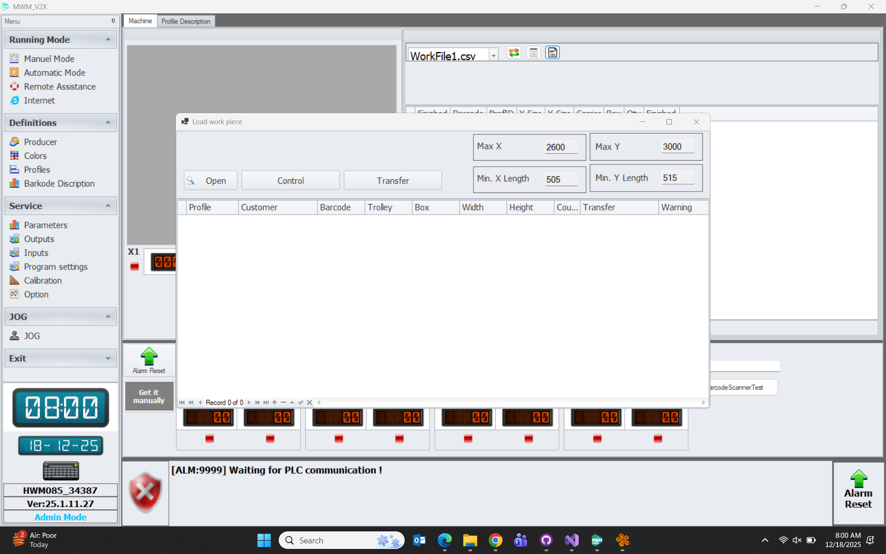

The file to be loaded is selected by clicking **Open**.
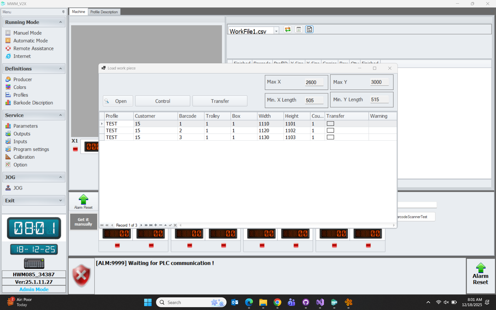

Then the csv is checked with **Control**.
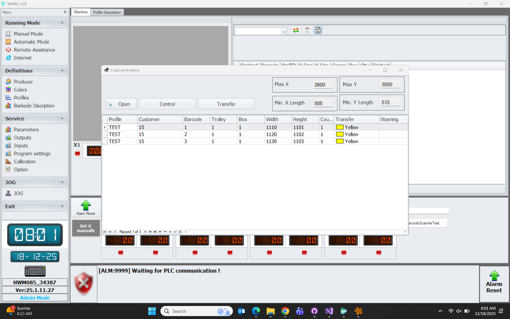

If there are no errors, we load the job file by clicking **Transfer**.
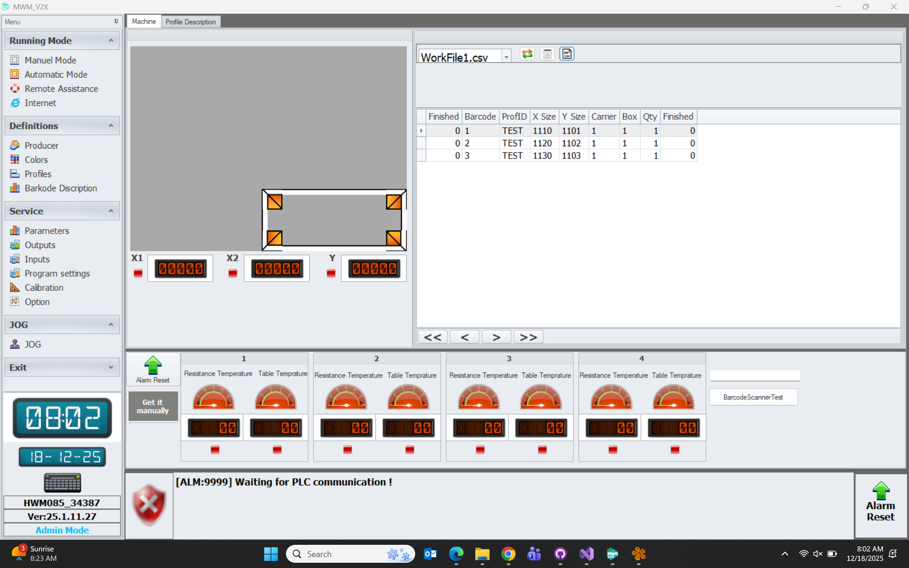

# Definitions

## Profiles
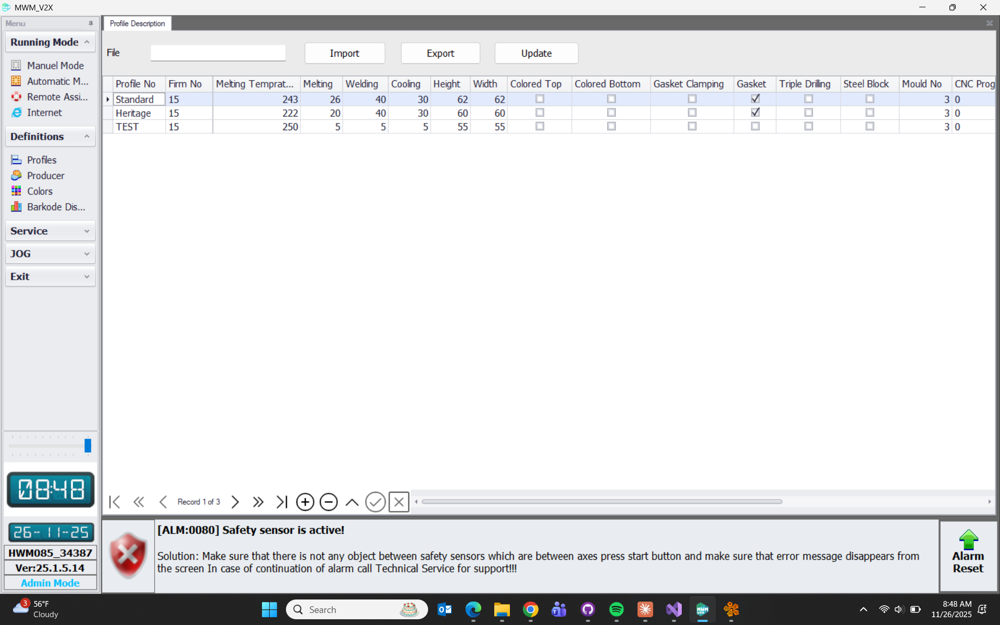

- This is the page where profile definitions are made.
**ResistanceNo:** If the Resistance No column value is **1**, the resistance step works in standard welding position. If **0**, it works in heritage welding position.

## Producer
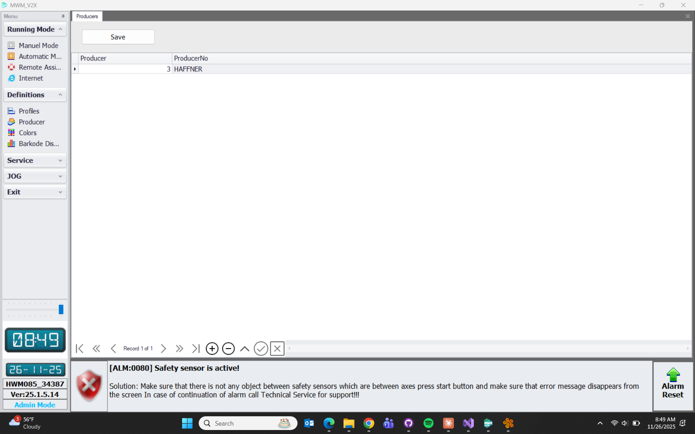

- This is the page where manufacturer information is added for the profile.

## Color
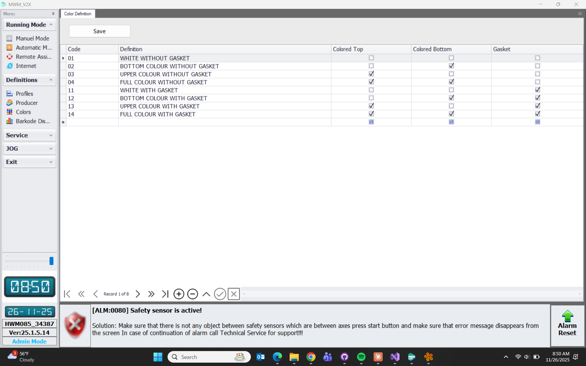

- This is the page where color, gasket, bottom or top information is defined with the desired code information for the profile.

## Barcode
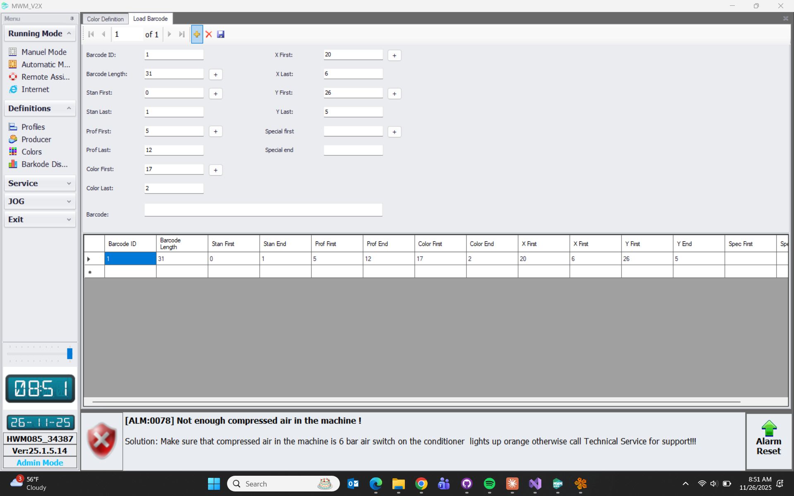

- **Barcode Length:** Specifies the character length used in the barcode.
- **Stan First-Last:** Specifies the range of the standard start character.
- **Profile First-Last:** Specifies the character range where the profile code is defined.
- **Color First-Last:** Specifies the character range where the color information is defined.
- **X First-Last:** Specifies the character range where the frame X length value information is defined.
- **Y First-Last:** Specifies the character range where the frame Y length value information is defined.
- **Special First-Last:** This is the field where definitions must be made for barcodes using special characters. It should be left blank for standard barcodes.

# Service

## Parameters Page
- This is the page containing all parameters of the machine.
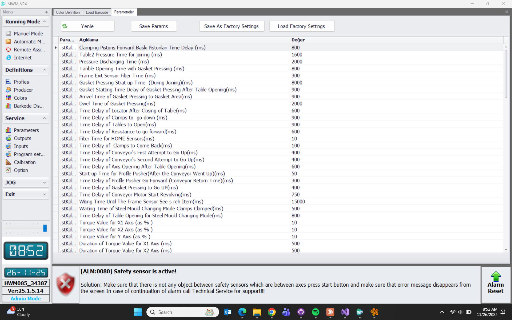

## Outputs
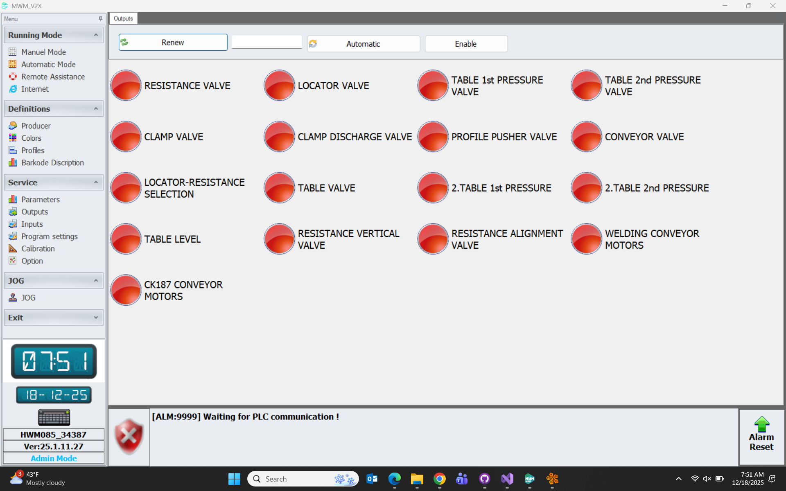

- The **Enable** button on the page is pressed. Then we click on the output we want to move to activate that output. Then we click again to return that output to its original position.
By clicking the **Automatic** button, the selected output automatically performs set-reset operations for the entered duration.

## Input Page
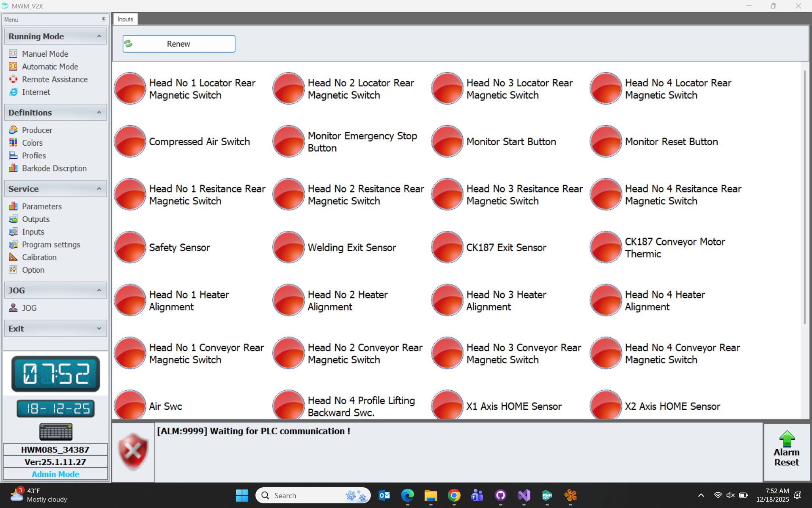

- This is the page containing the buttons, sensors and switches on the machine.

## Program Settings

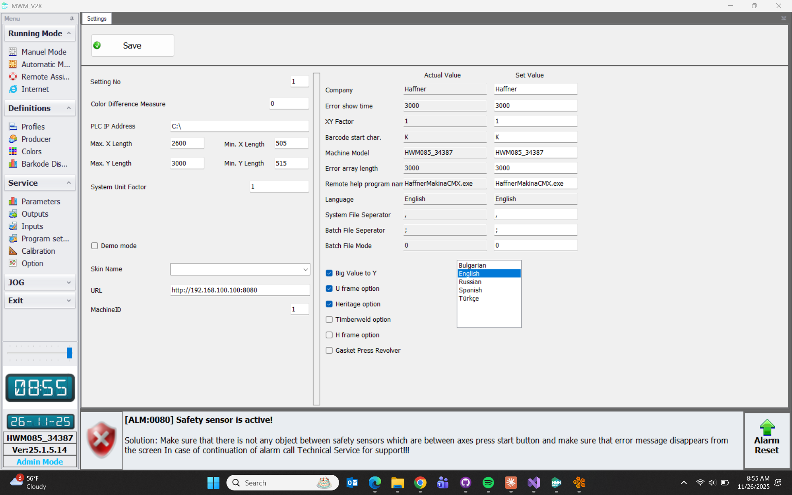

- This is the page where settings that will affect the machine's operation, welding types and language selection are made.
- **Setting No:**
- **Color Difference Measure:** Opens the axes by the value entered for colored profiles.
- **PLC IP:**
- **Max X Len:** Maximum X value limit to be entered for welding.
- **Min X Len:** Minimum X value limit to be entered for welding.
- **Max Y Len:** Maximum Y value limit to be entered for welding.
- **Min Y Len:** Minimum Y value limit to be entered for welding.
- **System Unit Factor:** Represents the division of numerical values used in the machine by the entered value. (E.g.: 1 for mm, 25.4 for inches, etc.)
- **Demo mode:** If selected, the machine operates in demo mode.
- **URL:** If communication will be established with the CN784 machine, the relevant IP address is entered and communication with the CN784 interface is provided.
- **Machine ID:** This is the ID number entered for information about which welding machine the data is coming from to CN784.

### Axis Calibration
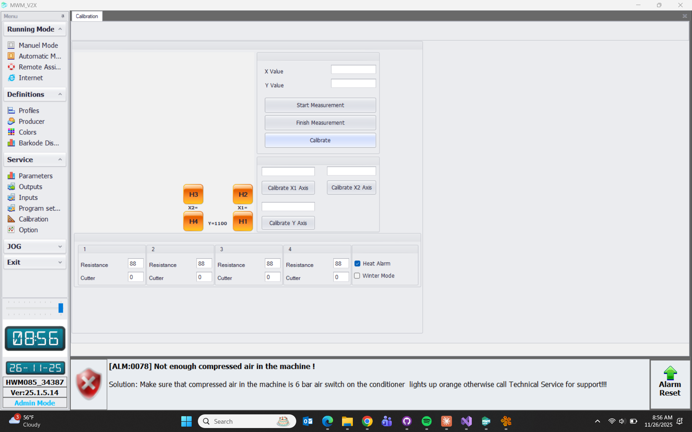

- After the relevant axis is selected on the page, we enter the value we want to calibrate the axis to in the **Calibration Value** field. When we press the **Calibrate** button at the bottom of the page, it will calibrate the axis to our desired value and the calibrated value will appear on the **Axis Actual Value** side.

## Options
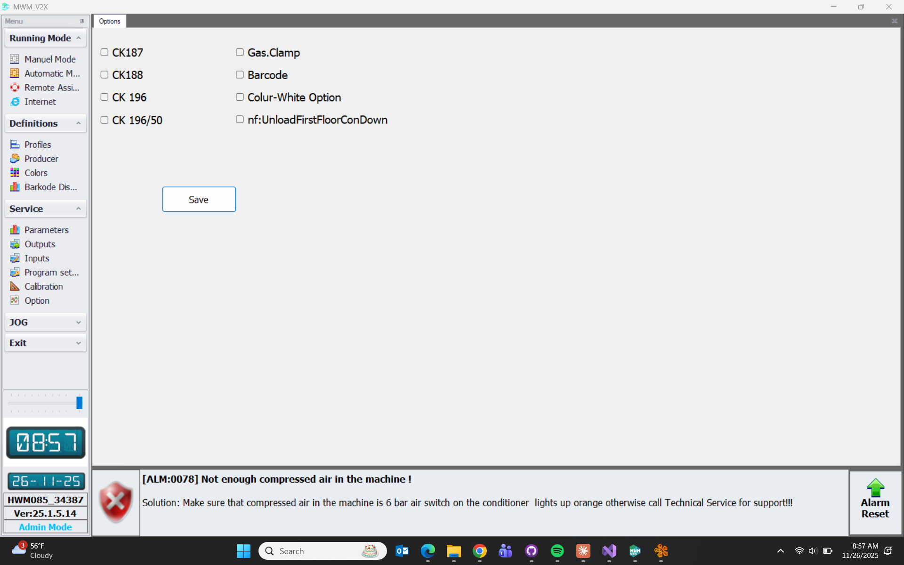

- This is the page where machine options are located.
- **CK187:** This option is activated if there is a cooling station after the welding machine.
- **CK188:** This option is activated if there is a triple drilling station after the welding machine.
- **CK196:** This option is activated if there is a 2nd corner cleaning machine to which transfer will be made after the welding machine.
- **CK196/50:** This option is activated if there is a roller cooling station to which transfer will be made after the welding machine.
- **Gas. Clamp:** This option is activated if there is gasket pressure in the machine.
- **Barcode:** This option is activated if there is a barcode reader in the machine.
- **Colour-White:** This option is activated if there is a colored pin in the machine.
- **Unload First Floor Con Down:** In a double-deck welding machine, it unloads the 1st floor with the conveyor in reset position.

# Jog Page
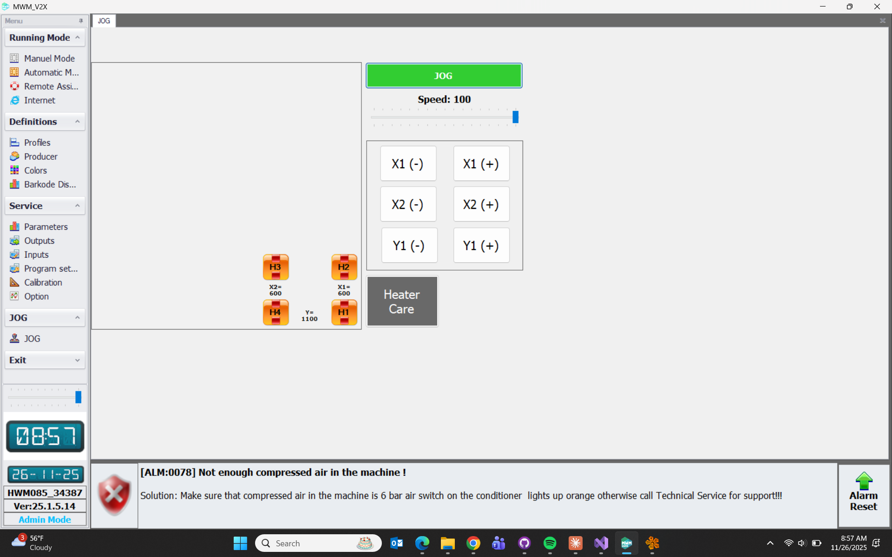

**Jog:** After pressing the **JOG** button on the page, the JOG- and JOG+ buttons are used to move the relevant axis to the desired position by pressing the relevant axis button.
